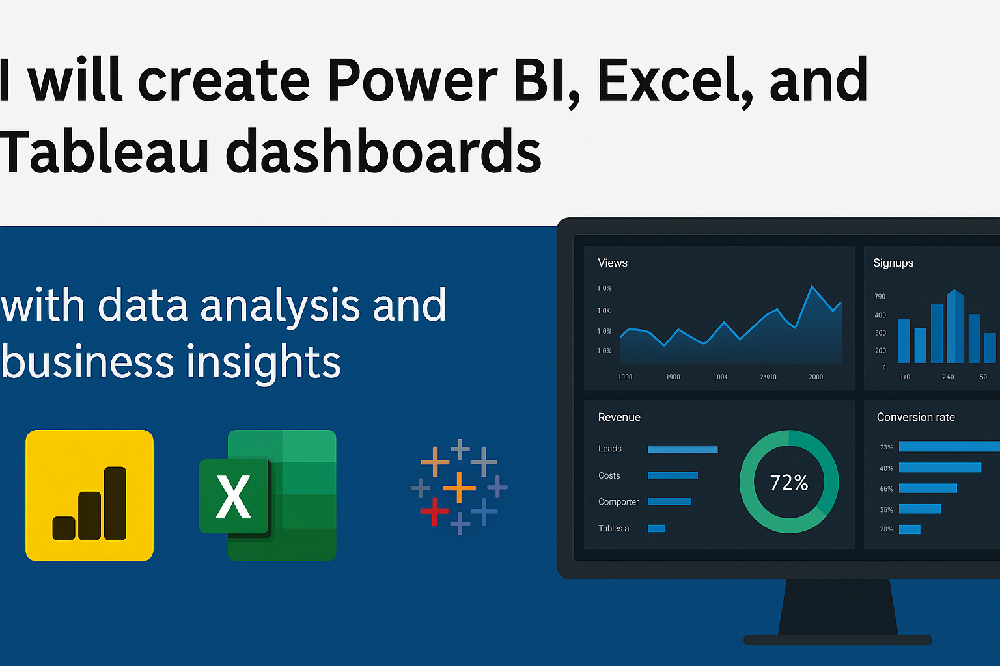
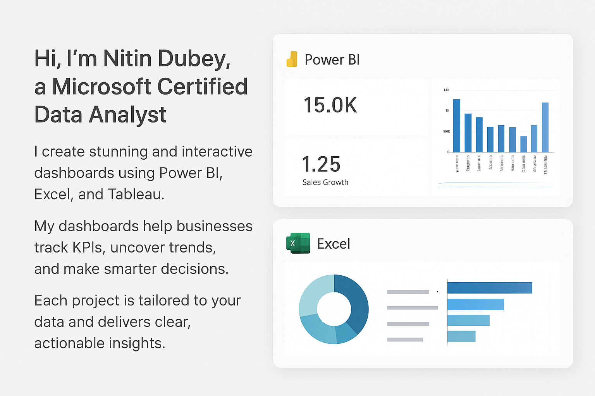
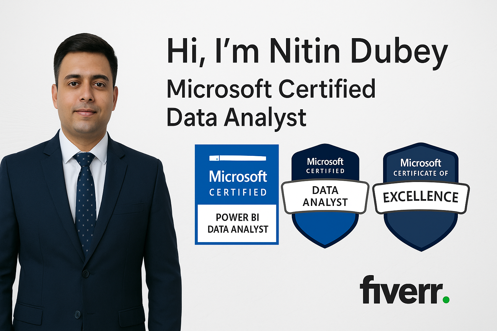
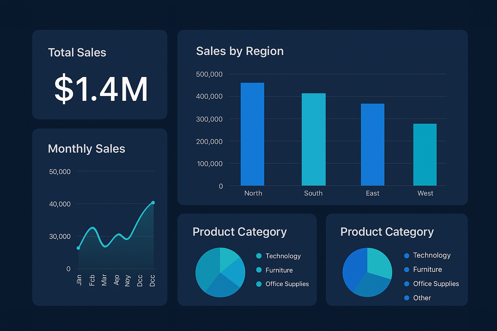

# 🌐 Nitin Dubey — Data Analyst & Data Scientist  

Personal portfolio website showcasing my work, skills, and achievements in **Data Analytics, Data Science, and Business Intelligence**.  

---

## 🚀 Features
- 👤 Profile photo (`profile.png`)  
- 🎞️ Animated background slideshow (Dashboards & Code)  
- 💻 Code rain animation (HTML, CSS, Python, R, SQL, DAX)  
- 📊 **NEW: Interactive BI Dashboard** with Plotly visualizations
- 🧠 **NEW: AI-Powered Business Insights** generator
- 📈 **Advanced KPIs**: YOY, MOM, LFL, Sell-Through, SOH, GRDC tracking
- 📄 Resume download (`resume.pdf`)  
- 🏆 Certificates view (`certificates.pdf`)  
- 📱 WhatsApp buttons ([7772011682](https://wa.me/7772011682) & [8462011346](https://wa.me/8462011346))  
- 🔗 LinkedIn: [linkedin.com/in/nitin-dubey-48249aa1](https://www.linkedin.com/in/nitin-dubey-48249aa1)  
- 📊 Portfolio page with dashboard previews  

---

## 📊 Dashboard Features

### Interactive Business Intelligence Dashboard
- **10,000+ Sales Transactions** with comprehensive analytics
- **1,200+ SKU Inventory** tracking with SOH monitoring
- **Budget vs Actual** variance analysis
- **GRDC Tracking** for supply chain management
- **6 Interactive Plotly Charts**:
  - Sales trend line chart
  - Category performance bar chart
  - Top products ranking
  - Regional performance comparison
  - Profit margin analysis
  - Inventory status distribution

### AI-Powered Insights
- Automated business insights generation
- Revenue and profit analysis
- Top performer identification
- Inventory alerts and recommendations
- Trend analysis with actionable insights

---

## 🛠️ Generate Dashboard

### Prerequisites
```bash
pip install -r requirements.txt
```

### Run Dashboard Generator
```bash
python3 generate_dashboard.py
```

This will create:
- `dashboard_interactive.html` - Full interactive dashboard
- `insights.html` - AI-generated insights
- Sample CSV datasets for analysis

See [DASHBOARD_README.md](DASHBOARD_README.md) for detailed documentation.

---

## 📸 Portfolio Preview  

<p align="center">
  
  
  
  
  
</p>

---

## 🛠️ Technologies Used
- HTML5  
- CSS3 (Flexbox, Grid, Animations)  
- JavaScript (Slideshow, Canvas Effects)
- **Python 3** (Data generation & processing)
- **Pandas & NumPy** (Data analysis)
- **Plotly** (Interactive visualizations)
- GitHub Pages (Hosting)  

---

## 📂 Project Structure

```
├── index.html                      # Main landing page
├── portfolio.html                  # Portfolio showcase
├── dashboard.html                  # Basic dashboard
├── dashboard_interactive.html      # Advanced Plotly dashboard ⭐
├── insights.html                   # AI insights page ⭐
├── generate_dashboard.py           # Dashboard generator script ⭐
├── requirements.txt                # Python dependencies ⭐
├── DASHBOARD_README.md             # Dashboard documentation ⭐
├── .gitignore                      # Git ignore rules
├── style.css                       # Stylesheet
├── resume.pdf                      # Resume
├── certificates.pdf                # Certificates
└── *.png                          # Images and screenshots
```

---

## 🌐 Live Website

**Portfolio**: [https://nitindb901.github.io/Nitindb901-nitin-official-website/](https://nitindb901.github.io/Nitindb901-nitin-official-website/)

### Direct Links:
- 🏠 [Home Page](https://nitindb901.github.io/Nitindb901-nitin-official-website/)
- 📊 [Interactive Dashboard](https://nitindb901.github.io/Nitindb901-nitin-official-website/dashboard_interactive.html)
- 🧠 [AI Insights](https://nitindb901.github.io/Nitindb901-nitin-official-website/insights.html)
- 💼 [Portfolio](https://nitindb901.github.io/Nitindb901-nitin-official-website/portfolio.html)

---

## 📧 Contact

**Nitin Dubey**  
Data Analyst | Data Scientist | BI Specialist

- 📱 WhatsApp: [7772011682](https://wa.me/7772011682) | [8462011346](https://wa.me/8462011346)
- 💼 LinkedIn: [linkedin.com/in/nitin-dubey-48249aa1](https://www.linkedin.com/in/nitin-dubey-48249aa1)
- 🌐 Website: [nitindb901.github.io](https://nitindb901.github.io/Nitindb901-nitin-official-website/)

---

## ⭐ Key Highlights

- ✅ **10,000+ transactions** analyzed
- ✅ **Advanced KPIs**: YOY, MOM, LFL, Sell-Through Rate
- ✅ **Real-time insights** with AI-powered analysis
- ✅ **Interactive visualizations** using Plotly
- ✅ **Fully responsive** design for all devices
- ✅ **Professional portfolio-ready** dashboard
- ✅ **GitHub Pages deployment** ready

---

## 📄 License

This project is part of a professional portfolio. Feel free to explore and learn from the code structure.

---

**Last Updated**: November 15, 2025  
**Version**: 2.0.0 (Dashboard Enhanced)
